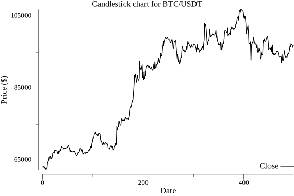
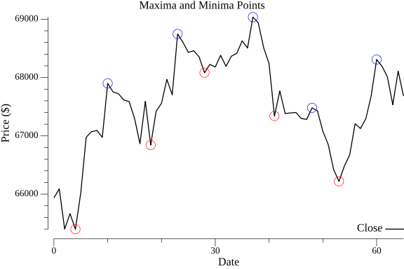
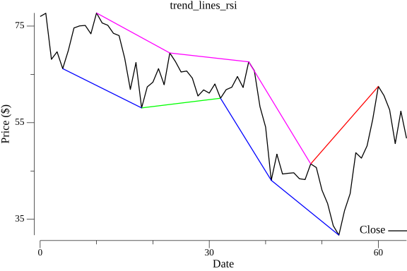
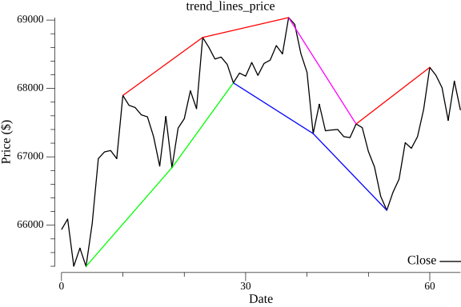

# **Divergence Detection in Trading**

This project demonstrates how to detect divergence between price movements and an indicator (e.g., RSI). It is a part of a private event-based trading system strategy aimed at showcasing and studying the concept of divergence in trading.

## **What is Divergence in Trading?**

In trading, divergence occurs when the price of an asset moves in the opposite direction of an indicator, such as the Relative Strength Index (RSI) or the Moving Average Convergence Divergence (MACD). Divergence can signal potential trend reversals or continuations, making it a valuable tool for traders.

There are two primary types of divergence:

1. **Bullish Divergence**:

   - Occurs when the price creates lower lows, but the indicator creates higher lows.
   - Often indicates a potential upward reversal in price.

2. **Bearish Divergence**:
   - Occurs when the price creates higher highs, but the indicator creates lower highs.
   - Often signals a potential downward reversal in price.

By detecting divergence, traders aim to identify potential entry and exit points more effectively.

---

## **How the Strategy Demonstration Works**

### 1. **Loading Candle Data**

The demonstration begins by loading historical candlestick data from a file. For this example, we are using the last 500 four-hour (4H) candles fetched from the Bybit API.

### 2. **Visualizing Candles**

The loaded candle data is visualized as a line chart to provide a clear overview of the market movements during the observed period. Below is an example plot of the loaded candles:

### **3. Identifying Local Highs and Lows**

To make the example clearer, we use a smaller subset of the data — the first **80 candles**. For these 80 data points, we use only the **close values** of the candles.

#### **Calculating RSI**

Using the close values of the first 80 candles, we calculate the **Relative Strength Index (RSI)**, which will be used to compare with the price data to identify divergences.

#### **Finding Local Highs and Lows**

For both the RSI values and the candle closes, we identify local highs and lows using a custom function. These local extrema are determined based on a given **order value** (in this case, `4`). The order value determines how many data points on either side are compared to classify a point as a local high or low.

### **4. Detecting Trends with Maxima and Divergence Points**

After identifying the local maxima and minima in the previous step, we now draw **trend lines** between these points to detect potential trends and divergences.

#### **Drawing Trend Lines**

For each set of maxima (or minima), we draw lines connecting the points, creating a visual representation of trends:

- **Highs**: Connecting successive higher or lower highs.
- **Lows**: Connecting successive higher or lower lows.

These lines help highlight possible divergences between price and RSI.

#### **Visualization**

We overlay these trend lines on two charts:

1. **RSI Chart**: Displays the RSI values with the trend lines drawn between the maxima (or minima).
2. **Price Chart**: Displays the candle close prices with similar trend lines.

The trend lines use the following color scheme:

- **Red**: Higher highs.
- **Green**: Higher lows.
- **Blue**: Lower lows.
- **Pink**: Lower highs.

**RSI with Trend Lines**  

**Price with Trend Lines**  

### **5. Detecting Divergences**

After plotting the trend lines, we now analyze the peaks (highs and lows) for both the price and RSI to identify possible divergences.

#### **Identifying Peaks**

We create separate lists for:

- **High Peaks**: Contains the high points for both price and RSI.
- **Low Peaks**: Contains the low points for both price and RSI.

#### **Comparing Peaks**

By comparing the lists of highs and lows for price and RSI:

- We detect whether the price and RSI are diverging.
- For example, if the price shows a high while the RSI shows a low (or vice versa), this could signal a divergence.

#### **Results**

The detected divergences are saved to a list and printed for reference.  
In our example, the results are as follows:

**Divergences Detected**:

1. **Hidden Bullish Divergence**:  
   Date: **2024-10-18 10:00:00 +0200 CEST**
2. **Regular Bearish Divergence**:  
   Date: **2024-10-19 06:00:00 +0200 CEST**
3. **Regular Bearish Divergence**:  
   Date: **2024-10-21 14:00:00 +0200 CEST**

We confirm these divergences visually using the previously generated plots:

This step marks the end of the divergence detection demonstration, providing valuable insights for trading strategies.

> **Note**: The images above are generated programmatically from the loaded data.
